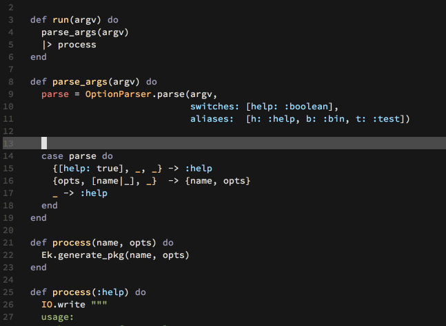

[![License GPL 3][badge-license]](http://www.gnu.org/licenses/gpl-3.0.txt)
[](https://travis-ci.org/tonini/alchemist.el)
[](http://melpa.org/#/alchemist)
[](http://stable.melpa.org/#/alchemist)
[](https://www.paypal.com/cgi-bin/webscr?cmd=_donations&business=tonini%2esamuel%40gmail%2ecom&lc=CH&item_name=Support%20Alchemist%20maintainer&currency_code=USD&bn=PP%2dDonationsBF%3abtn_donateCC_LG%2egif%3aNonHostedGuest)

<br/>

<p align="left">
  
</p>

> Elixir Tooling Integration Into Emacs</blockquote>

Alchemist comes with a bunch of **features**, which are:

* Mix integration
* Compile & Execution of Elixir code
* Inline code evaluation
* Documentation lookup
* Definition lookup
* Powerful IEx integration
* Smart code completion
* Elixir project management
* Integration with [company-mode](http://company-mode.github.io/)

***

- [Installation](#installation)
  - [Requirements](#requirements)
  - [ELPA](#installation-via-packageel)
  - [Via el-get](#via-el-get)
  - [Manual](#manual)
- [Configuration](#configuration)
  - [Mix setup](#mix-setup)
  - [IEx setup](#iex-setup)
  - [Execute setup](#execute-setup)
  - [Compile setup](#compile-setup)
  - [Keybindings](#keybindings)
  - [Testing-Mode](#testing-mode)
  - [Hooks](#hooks)
- [Server](#server)
- [Mix](#mix)
  - [Mix Task Mode](#mix-task-mode)
- [Testing](#testing)
- [Compile & Execute](#compile-and-execute)
  - [Compile](#compile-functions)
  - [Execute](#execute-functions)
- [Project](#project)
- [alchemist-phoenix-mode](#alchemist-phoenix-mode)
- [Documentation lookup](#documentation-lookup)
  - [Keymap](#alchemist-help-minor-mode-keymap)
- [Definition lookup](#definition-lookup)
  - [Symbol definitions](#symbol-definitions)
- [Auto-completion](#auto-completion)
- [IEx](#iex)
  - [Complete & Documentation lookup](#complete--documentation-lookup)
- [Eval](#eval)
- [Testing Mode](#testing-mode)
  - [Testing-Report](#testing-report)
- [Modeline](#modeline)
- [Keymap](#keymap)
  - [Refcards](#refcards)
- [Support](#support)
- [Contributing](#contributing)
- [License](#license)


## Installation

### Requirements

  * [Emacs](https://www.gnu.org/software/emacs/) 24.4 or later
  * [Elixir](http://elixir-lang.org/) 1.0 or later

### Installation via package.el

`package.el` is the built-in package manager in Emacs.

Alchemist.el is available on the three major community maintained repositories -
[MELPA STABLE](https://stable.melpa.org), [MELPA](https://melpa.org) and [Marmalade](https://marmalade-repo.org/).

You can install `Alchemist` with the following command:

<kbd>M-x package-install [RET] alchemist [RET]</kbd>

or by adding this bit of Emacs Lisp code to your Emacs initialization file
(`.emacs` or `init.el`):

```el
(unless (package-installed-p 'alchemist)
  (package-install 'alchemist))
```

If the installation doesn't work try refreshing the package list:

<kbd>M-x package-refresh-contents [RET]</kbd>

Keep in mind that MELPA packages are built automatically from
the `master` branch, meaning bugs might creep in there from time to
time. Never-the-less, installing from MELPA is the recommended way of
obtaining Alchemist, as the `master` branch is normally quite stable and
"stable" (tagged) builds are released somewhat infrequently.

With the most recent builds of Emacs, you can pin Alchemist to always
use MELPA Stable by adding this to your Emacs initialization:

```el
(add-to-list 'package-pinned-packages '(alchemist . "melpa-stable") t)
```

### Via el-get

[el-get](https://github.com/dimitri/el-get) is another popular package manager for Emacs. If you're an el-get
user just do <kbd>M-x el-get-install [RET] alchemist [RET]</kbd>.

### Manual

You can install Alchemist manually by placing Alchemist on your `load-path` and
`require` ing it. Many people favour the folder `~/.emacs.d/vendor`.

```el
(add-to-list 'load-path "~/.emacs.d/vendor/alchemist.el/")
(require 'alchemist)
```

## Configuration

There are some ways Alchemist can be adjusted that certain workflows operating differently.

### Mix setup

* Use a different shell command for mix.

```el
(setq alchemist-mix-command "/usr/local/bin/mix")
```

* Use a different task for running tests.

```el
(setq alchemist-mix-test-task "espec")
```

* Use custom mix test task options.

```el
(setq alchemist-mix-test-default-options '()) ;; default
```

* Use a different environment variable in which mix tasks will run.

Mix tasks could always be executed in a specific environment with the usage of `C-u` (universal-argument).
But if you like to change the run of Mix task permanently to a specific environment set it
through the variable.

```el
(setq alchemist-mix-env "prod")
```

### IEx setup

* Use a different shell command for iex.

```el
(setq alchemist-iex-program-name "/usr/local/bin/iex") ;; default: iex
```

### Execute setup

* Use a different shell command for elixir.

```el
(setq alchemist-execute-command "/usr/local/bin/elixir") ;; default: elixir
```

### Compile setup

* Use a different shell command for elixirc.

```el
(setq alchemist-compile-command "/usr/local/bin/elixirc") ;; default: elixirc
```

### Modeline setup

* Disable the change of the modeline color with the last test run status.

```el
(setq alchemist-test-status-modeline nil)
```

### Keybindings

* Use a different keybinding prefix than <kbd>C-c a</kbd>

```el
(setq alchemist-key-command-prefix (kbd "C-c ,")) ;; default: (kbd "C-c a")
```

### Testing Mode

* Disable the use of a more significant syntax highlighting on functions like `test`, `assert_*` and `refute_*`

```el
(setq alchemist-test-mode-highlight-tests nil) ;; default t
```

* Don't ask to save changed file buffers before running tests.

```el
(setq alchemist-test-ask-about-save nil)
```

* Don't change the color of the `mode-name` when test run failed or passed.

```el
(setq alchemist-test-status-modeline nil)
```

* Show compilation output in test report.

```el
(setq alchemist-test-display-compilation-output t)
```

### Hooks

* Run the whole test suite with `alchemist-mix-test` after saving a buffer.

```el
(setq alchemist-hooks-test-on-save t)
```

## Server

Alchemist works as a server & client model, where the Alchemist server is written in Elixir and Emacs takes the part of the client.

For each Elixir mix project Alchemist starts an independent server in the background. If an Elixir file gets opened in a buffer,
Alchemist checks if a server is running for the current project or not and starts a new one if needed. If there is no Elixir mix project found, Alchemist
starts a general unique server.

An Alchemist server can be started/restarted by hand with the call of the function `alchemist-server-start`.
A prompt for the environment in which the server should run (default: `dev`) gets opened and the server will start/restart in the selected environment.

To get the server status for the current project, just call the function `alchemist-server-status` and a report will be displayed in the minibuffer:

```
Alchemist-Server-Status: [Project: /Users/tonini/Projects/ek/ Status: Connected]
```

## Mix

| Keybinding | Description |
|-------------------|-------------|
|<kbd>C-c a x</kbd>|Prompt for a mix command including a list of all available mix commands. `alchemist-mix`|
|<kbd>C-c a m c</kbd>|Compile the whole elixir project. `alchemist-mix-compile`|
|<kbd>C-c a m r</kbd>|Runs the given file or expression in the context of the application. `alchemist-mix-run`|

Mix tasks could also be executed in a specific environment with the usage of `C-u` (universal-argument).
Default environments are `prod`, `dev` and `test`. [Mix environments](http://elixir-lang.org/getting-started/mix-otp/introduction-to-mix.html#environments)

### Mix Task Mode

The Mix tasks running in a separate `alchemist-mix-mode`, in which the following keybindings are available:

| Keybinding   | Description                                          |
|--------------|------------------------------------------------------|
|<kbd>q</kbd>  |Quit `*mix*` buffer window                            |
|<kbd>i</kbd>  |Send an input to the current running mix task process.|

## Testing

| Keybinding | Description |
|-------------------|-------------|
|<kbd>C-c a t</kbd>|Run the whole elixir test suite. `alchemist-mix-test`|
|<kbd>C-c a r</kbd>|Rerun the last test that was run by alchemist. `alchemist-mix-rerun-last-test`|
|<kbd>C-c a m t f</kbd>|Run `alchemist-mix--test-file` with the FILENAME. `alchemist-mix-test-file`|
|<kbd>C-c a m t b</kbd>|Run the current buffer through mix test. `alchemist-mix-test-this-buffer`|
|<kbd>C-c a m t .</kbd>|Run the test at point. `alchemist-mix-test-at-point`|
|<kbd>C-c M-r</kbd>|Toggle between displaying or hidding the test report buffer. `alchemist-test-toggle-test-report-display`|

## Compile And Execute

### Compile functions

| Keybinding | Description |
|-------------------|-------------|
|<kbd>C-c a c c</kbd>|Compile the current buffer with the `elixirc` command. `alchemist-compile-this-buffer`|
|<kbd>C-c a c f</kbd>|Compile the given `FILENAME` with the `elixirc` command. `alchemist-compile-file`|
|<kbd>C-c a c b</kbd>|Run a custom compile command with `elixirc`. `alchemist-compile`|

### Execute functions

| Keybinding | Description |
|-------------------|-------------|
|<kbd>C-c a e b</kbd>|Run the current buffer through `elixir` command. `alchemist-execute-this-buffer`|
|<kbd>C-c a e f</kbd>|Run `elixir` command with the given `FILENAME`. `alchemist-execute-file` |
|<kbd>C-c a e e</kbd>|Run a custom execute command with `elixir`. `alchemist-execute` |

## Project

| Keybinding | Description |
|-------------------|-------------|
|<kbd>C-c a p s</kbd>|Toggle between a file and its tests in the current window. `alchemist-project-toggle-file-and-tests`|
|<kbd>C-c a p o</kbd>|Toggle between a file and its tests in other window. `alchemist-project-toggle-file-and-tests-other-window`|
|<kbd>C-c a p t</kbd>|Run the tests related to the current file. `alchemist-project-run-tests-for-current-file`|
|<kbd>C-c a p f</kbd>|List all files available in the `test` directory. `alchemist-project-find-test`|
|<kbd>C-c a p l</kbd>|List all files available in the `lib` directory. `alchemist-project-find-lib` |

## alchemist-phoenix-mode

| Keybinding | Description |
|-------------------|-------------|
|<kbd>C-c a n w</kbd>|List all files available in the `web` directory. `alchemist-phoenix-find-web`|
|<kbd>C-c a n c</kbd>|List all controllers in `web/controllers` directory. `alchemist-phoenix-find-controllers`|
|<kbd>C-c a n l</kbd>|List all channels in `web/channels` directory. `alchemist-phoenix-find-channels`|
|<kbd>C-c a n t</kbd>|List all templates in `web/templates` directory. `alchemist-phoenix-find-templates`|
|<kbd>C-c a n m</kbd>|List all models in `web/models` directory. `alchemist-phoenix-find-models`|
|<kbd>C-c a n v</kbd>|List all views in `web/views` directory. `alchemist-phoenix-find-views`|
|<kbd>C-c a n s</kbd>|List all files in `web/static` directory. `alchemist-phoenix-find-static`|
|<kbd>C-c a n r</kbd>|Open the `router.ex` file in `web` directory. `alchemist-phoenix-router`|
|<kbd>C-c a n R</kbd>|Run the Mix task `phoenix.routes`. `alchemist-phoenix-routes`|

## Documentation lookup

There is the `alchemist-help-minor-mode` for a complete fully functional
interface to the Elixir documentation. The `alchemist-help-minor-mode` uses the
same functions like Elixir's [IEx](http://elixir-lang.org/docs/stable/iex/).

What does that mean? It means no matter which Elixir version is currently
installed on the system, the documentation you get by `alchemist` is the same
`IEx` would deliver.

| Keybinding | Description                                     |
|------------|-------------------------------------------------|
|<kbd>C-c a h h</kbd>| Run a custom search. `alchemist-help`              |
|<kbd>C-c a h i</kbd>| Look through search history. `alchemist-help-history` |
|<kbd>C-c a h e</kbd>| Run `alchemist-help` with the expression under the cursor. (example: `is_binary`  or `Code.eval_string`). If there is a currently marked region this will be used as the search term. `alchemist-help-search-at-point` |
|<kbd>C-c a h r</kbd>| Open a buffer with a refcard of alchemist bindings. `alchemist-refcard`|

### Alchemist Help Minor Mode Keymap

Inside of the `alchemist-help-minor-mode` (`*elixir help*` buffer) the key `?` will
open a keymap summary in the `minibuffer` with the following functionality:

You're always be able to continue to search inside the `*elixir help*` buffer.

Hit <kbd>?</kbd> to get the keybinding summary for the `alchemist-help-minor-mode`.

```
[q]-quit [e]-search-at-point [s]-search [h]-history [?]-keys
```

| Keybinding | Description                                     |
|------------|-------------------------------------------------|
|<kbd>q</kbd>| Quit `*elixir help*` buffer window              |
|<kbd>e</kbd>| `alchemist-help-search-at-point`                |
|<kbd>s</kbd>| `alchemist-help`                                |
|<kbd>h</kbd>| `alchemist-help-history`                        |
|<kbd>?</kbd>| `alchemist-help-minor-mode-key-binding-summary` |

## Definition lookup

With the function `alchemist-goto-definition-at-point`, which is bound to <kbd>M-.</kbd>, you
can jump to module and function definitions. If you want to jump back, just use <kbd>M-,</kbd> which calls `alchemist-goto-jump-back`.

You also can jump to the current selected completion candidate with just hit the same key as normally, <kbd>M-.</kbd>.

By default you're able to jump to definitions of your own mix project codebase and dependencies.
But if you would like to also jump to Elixir and Erlang source code you need to tell Alchemist where
it can find the source code of Elixir and Erlang.

For that purpose there're two variables you can set:

```el
(setq alchemist-goto-erlang-source-dir "/path/to/erlang/source/")
```

```el
(setq alchemist-goto-elixir-source-dir "/path/to/elixir/source/")
```

If you inside an Erlang file and the `erlang-mode` is enabled you can't use `alchemist-goto-jump-back` anymore.
But if you would like to use it also inside the `erlang-mode` just setup the following custom hook:

```el
(defun custom-erlang-mode-hook ()
  (define-key erlang-mode-map (kbd "M-,") 'alchemist-goto-jump-back))

(add-hook 'erlang-mode-hook 'custom-erlang-mode-hook)
```


### Symbol definitions

There is the function `alchemist-goto-list-symbol-definitions` which lets you jump to a specific module, function or macro definitions in the current file.

## Auto-completion

Alchemist users are advised to use
[company-mode](http://company-mode.github.io/) to enable auto-completion inside
of Elixir source code.

Alchemist enables a [company-mode](http://company-mode.github.io/) elixir backend by default if company-mode is
installed.



There are the same keybindings for documentation lookup and definition opening for the selected
candidate available like [company-mode](http://company-mode.github.io/) [provides](https://github.com/company-mode/company-mode/blob/27c913afb9446971d1e0f1f3b272e5650a6206c5/company.el#L609).

<kbd>C-h</kbd> and <kbd>\<f1\></kbd> for documentation lookup for the current selected candidate.
<kbd>C-w</kbd> to jump to the definition of the current selected candidate.


## IEx

Alchemist provides a `REPL` buffer, connected to an
[Elixir IEx](http://elixir-lang.org/docs/master/iex/IEx.html) subprocess.

To start an IEx process just run <kbd>M-x alchemist-iex-run</kbd>

To start an IEx process in the context of an Elixir project (`iex -S mix`) just run <kbd>M-x alchemist-iex-project-run</kbd>

To start a custom IEx process with additional arguments (like: `iex --sname custom`) just use the
[universal-argument](http://www.gnu.org/software/emacs/manual/html_node/emacs/Arguments.html) <kbd>C-u</kbd>
before run <kbd>M-x alchemist-iex-run</kbd>

| Keybinding | Description |
|--------------------|------------------------------------------|
|<kbd>C-c a i i</kbd>| Start an IEx process. `alchemist-iex-run`|
|<kbd>C-c a i p</kbd>| Start an IEx process with mix (`iex -S mix`). `alchemist-iex-project-run`|
|<kbd>C-c a i l</kbd>| Sends the current line to the IEx process. `alchemist-iex-send-current-line`|
|<kbd>C-c a i c</kbd>| Sends the current line to the IEx process and jump to the buffer.. `alchemist-iex-send-current-line-and-go`|
|<kbd>C-c a i r</kbd>| Sends the marked region to the IEx process. `alchemist-iex-send-region`|
|<kbd>C-c a i m</kbd>| Sends the marked region to the IEx process and jump to the buffer. `alchemist-iex-send-region-and-go`|
|<kbd>C-c a i b</kbd>| Compiles the current buffer in the IEx process. `alchemist-iex-compile-this-buffer`|

### Complete & Documentation lookup

When Alchemist finds [company-mode](http://company-mode.github.io/) it enables
if for completion inside the IEx process buffer.

## Eval

Alchemist comes with the functionality to evaluate code inside the buffer.

| Keybinding | Description |
|--------------------|------------------------------------------|
|<kbd>C-c a v l</kbd>| Evaluate the Elixir code on the current line. `alchemist-eval-current-line`.|
|<kbd>C-c a v k</kbd>| Evaluate the Elixir code on the current line and insert the result. `alchemist-eval-print-current-line`.|
|<kbd>C-c a v j</kbd>| Get the Elixir code representation of the expression on the current line. `alchemist-eval-quoted-current-line`. |
|<kbd>C-c a v h</kbd>| Get the Elixir code representation of the expression on the current line and insert the result. `alchemist-eval-print-quoted-current-line`. |
|<kbd>C-c a v o</kbd>| Evaluate the Elixir code on marked region. `alchemist-eval-region`.|
|<kbd>C-c a v i</kbd>| Evaluate the Elixir code on marked region and insert the result. `alchemist-eval-print-region`.|
|<kbd>C-c a v u</kbd>| Get the Elixir code representation of the expression on marked region. `alchemist-eval-quoted-region`.|
|<kbd>C-c a v y</kbd>| Get the Elixir code representation of the expression on marked region and insert the result. `alchemist-eval-print-quoted-region`.|
|<kbd>C-c a v q</kbd>| Evaluate the Elixir code in the current buffer. `alchemist-eval-buffer`.|
|<kbd>C-c a v w</kbd>| Evaluate the Elixir code in the current buffer and insert the result. `alchemist-eval-print-buffer`.|
|<kbd>C-c a v e</kbd>| Get the Elixir code representation of the expression in the current buffer. `alchemist-eval-quoted-buffer`.|
|<kbd>C-c a v r</kbd>| Get the Elixir code representation of the expression in the current buffer and insert result. `alchemist-eval-print-quoted-buffer`.|
|<kbd>C-c a v !</kbd>| Quit the Elixir evaluation buffer popup. `alchemist-eval-close-popup`.|

## Testing Mode

Alchemist comes with an minor mode for testing which will be enabled by default inside `*_test.exs` files.

| Keybinding | Description |
|--------------------|------------------------------------------|
|<kbd>C-c , s</kbd>| Run the test at point. `alchemist-mix-test-at-point` |
|<kbd>C-c , v</kbd>| Run all tests in the current file. `alchemist-mix-test-this-buffer` |
|<kbd>C-c , a</kbd>| Run the whole elixir test suite. `alchemist-mix-test` |
|<kbd>C-c , f</kbd>| Run all tests of a specific file `alchemist-mix-test-file` |
|<kbd>C-c , n</kbd>| Jump to the next test inside the current file. `alchemist-test-mode-jump-to-next-test` |
|<kbd>C-c , p</kbd>| Jump to the previous test inside the current file `alchemist-test-mode-jump-to-previous-test` |

### Testing Report

The tests are reported in the `alchemist-test-report-mode`, which have the following keybindings:

| Keybinding | Description |
|--------------------|------------------------------------------|
|<kbd>M-n</kbd>| Jump to the next error in the test report. `alchemist-test-next-result` |
|<kbd>M-p</kbd>| Jump to the previous error in the test report. `alchemist-test-previous-result` |
|<kbd>M-N</kbd>| Jump to the next stacktrace file in the test report. `alchemist-test-next-stacktrace-file` |
|<kbd>M-P</kbd>| Jump to the previous stacktrace file in the test report. `alchemist-test-previous-stacktrace-file` |
|<kbd>C-c C-k</kbd>| Interrupt the current running report process. `alchemist-report-interrupt-current-process` |
|<kbd>q</kbd>| Close the test report window |

## Keymap

Alchemist comes with a default keymap.

The the default prefix keybinding is <kbd>C-c a</kbd>

### Refcards

You find and overview of all the key-bindings on the [Alchemist-Refcard](https://github.com/tonini/alchemist.el/blob/master/doc/alchemist-refcard.pdf?raw=true).

There is also a refcard for usage inside Emacs, which gets dynamically generated with the current adjusted keybindings.
If you use the keybinding <kbd>i</kbd> on a specific row, it will call `describe-function` on that function.

Just `M-x alchemist-refcard RET`

## Support

If you hit any problems, please first ensure that you are using the latest version of this code,
and that you have updated your packages to the most recent available versions.

* To report bugs or feature requests: please use the [issue tracker on Github](https://github.com/tonini/alchemist.el/issues).
* To talk about the project with people in real time: please join the #elixir-emacs channel on [IRC](http://de.wikipedia.org/wiki/Internet_Relay_Chat)
  or the #emacs channel on [Elixir Slack](https://elixir-lang.slack.com).

## Contributing

We appreciate any contribution to Alchemist, so check out our [Contribution guidelines](CONTRIBUTING.md) for more information.

## License

Copyright © 2014-2015 Samuel Tonini and
[contributors](https://github.com/tonini/alchemist.el/contributors).

Distributed under the GNU General Public License, version 3

[badge-license]: https://img.shields.io/badge/license-GPL_3-green.svg
