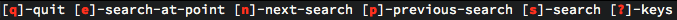
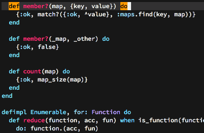
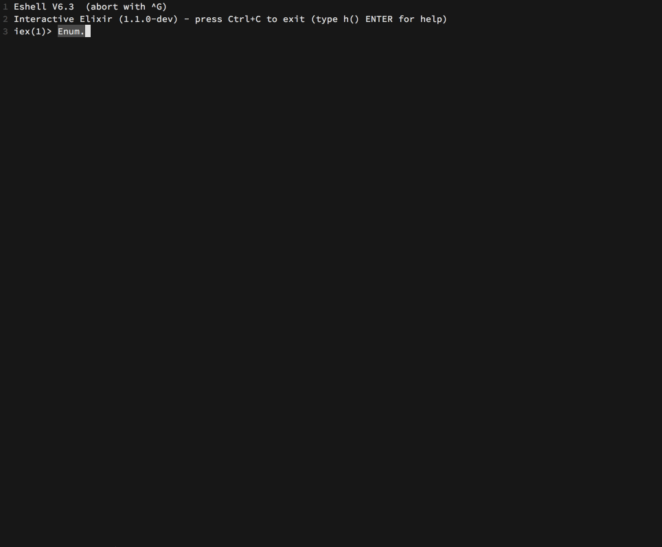
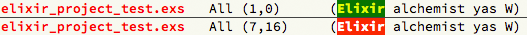

[![License GPL 3][badge-license]](http://www.gnu.org/licenses/gpl-3.0.txt)
[](https://travis-ci.org/tonini/alchemist.el)
[](http://melpa.org/#/alchemist)
[](http://stable.melpa.org/#/alchemist)
[](https://gratipay.com/tonini/)

<br/>

<p align="center">
  
</p>

> Elixir Tooling Integration Into Emacs</blockquote>

Alchemist comes with a bunch of features, which are:

* Powerful IEx integration
* Mix integration
* Compile & Execution of Elixir code
* Inline code evaluation
* Documentation lookup
* Definition lookup
* Smart code completion
* Elixir project management
* Integration with [company-mode](http://company-mode.github.io/)

***

- [Installation](#installation)
  - [ELPA](#installation-via-packageel)
  - [Via el-get](#via-el-get)
  - [Manual](#manual)
- [Configuration](#configuration)
- [Mix](#mix)
- [Compile & Execute](#compile-and-execute)
  - [Compile](#compile-functions)
  - [Execute](#execute-functions)
- [Project](#project)
- [Documentation lookup](#documentation-lookup)
  - [Keymap](#alchemist-help-minor-mode-keymap)
- [Definition lookup](#definition-lookup)
- [Auto-completion](#auto-completion)
  - [Debug](#debug)
- [IEx](#iex)
  - [Complete & Documentation lookup](#complete--documentation-lookup)
- [Eval](#eval)
- [Hooks](#hooks)
- [Modeline](#modeline)
- [Keymap](#keymap)
- [Contributing](#contributing)


## Installation

### Installation via package.el

`package.el` is the built-in package manager in Emacs.

Alchemist.el is available on the three major community maintained repositories -
[MELPA STABLE](melpa-stable.milkbox.net), [MELPA](http://melpa.milkbox.net) and [Marmalade](https://marmalade-repo.org/).

You can install `Alchemist` with the following commnad:

<kbd>M-x package-install [RET] alchemist [RET]</kbd>

or by adding this bit of Emacs Lisp code to your Emacs initialization file
(`.emacs` or `init.el`):

```el
(unless (package-installed-p 'alchemist)
  (package-install 'alchemist))
```

If the installation doesn't work try refreshing the package list:

<kbd>M-x package-refresh-contents [RET]</kbd>

Keep in mind that MELPA packages are built automatically from
the `master` branch, meaning bugs might creep in there from time to
time. Never-the-less, installing from MELPA is the recommended way of
obtaining Alchemist, as the `master` branch is normally quite stable and
"stable" (tagged) builds are released somewhat infrequently.

With the most recent builds of Emacs, you can pin Alchemist to always
use MELPA Stable by adding this to your Emacs initialization:

```el
(add-to-list 'package-pinned-packages '(alchemist . "melpa-stable") t)
```

### Via el-get

[el-get](https://github.com/dimitri/el-get) is another popular package manager for Emacs. If you're an el-get
user just do <kbd>M-x el-get-install [RET] alchemist [RET]</kbd>.

### Manual

You can install Alchemist manually by placing Alchemist on your `load-path` and
`require` ing it. Many people favour the folder `~/.emacs.d/vendor`.

```el
(add-to-list 'load-path "~/.emacs.d/vendor/alchemist.el/")
(require 'alchemist)
```

## Configuration

There are some ways Alchemist can be adjusted that certain workflows operating differently.

* Disable ansi color formatted documentation:

```el
(setq alchemist-help-ansi-color-docs nil) ;; default: t
```

* Enable compilation if needed when do documentation lookup or completion on
Elixir project current codebase.

```el
(setq alchemist-project-compile-when-needed t) ;; default nil
```

* The function `alchemist-project-toggle-compile-when-needed` can also be used to enable/disable
compilation on the fly.

* By default, the error output of failed completions will be displayed in a
separat buffer.

Example output:

```shell
== ALCHEMIST COMPLETION FAILED ==
== OUTPUT BEGIN:
** (CompileError) mix.exs:5: function asdas/0 undefined
    (stdlib) lists.erl:1336: :lists.foreach/2
    (stdlib) erl_eval.erl:657: :erl_eval.do_apply/6

== OUTPUT END:
```

This behavior can be disabled with set the following variable.

```el
(setq alchemist-complete-debug-mode nil) ;; default t
```

### Project configuration file

To setup custom configurations for different Elixir projects, create a
`.alchemist` file in the root of the project.

Example:

```json
{
  "ansi-color-docs": "nil",
  "compile-when-needed": "t"
}
```

## Mix

<table>
    <tr>
        <th>Command (For the <code>M-x</code> prompt.)</th>
        <th>Description</th>
    </tr>
    <tr>
        <td><code>alchemist-mix</code></td>
        <td>Prompt for a mix command including a list of all available mix commands.</td>
    </tr>
    <tr>
        <td><code>alchemist-mix-new</code></td>
        <td>Create a new Elixir application.</td>
    </tr>
     <tr>
        <td><code>alchemist-mix-test</code></td>
        <td>Run the whole Elixir application test suite.</td>
    </tr>
    <tr>
        <td><code>alchemist-mix-test-this-buffer</code></td>
        <td>Run the current buffer through <code>mix test</code> command.</td>
    </tr>
    <tr>
        <td><code>alchemist-mix-test-file</code></td>
        <td>Run a file through <code>mix test</code> command.</td>
    </tr>
    <tr>
        <td><code>alchemist-mix-test-at-point</code></td>
        <td>Run the test at point.</td>
    </tr>
    <tr>
        <td><code>alchemist-mix-compile</code></td>
        <td>Compile the whole Elixir application.</td>
    </tr>
    <tr>
        <td><code>alchemist-mix-run</code></td>
        <td>Runs the given expression in the Elixir application context.</td>
    </tr>
    <tr>
        <td><code>alchemist-mix-deps-with-prompt</code></td>
        <td>Prompt for <code>mix deps</code> commands.</td>
    </tr>
    <tr>
        <td><code>alchemist-mix-local-with-prompt</code></td>
        <td>Prompt for <code>mix local</code> commands.</td>
    </tr>
    <tr>
        <td><code>alchemist-mix-local-install</code></td>
        <td>Prompt for <code>mix local.install</code> PATH or URL.</td>
    </tr>
    <tr>
        <td><code>alchemist-mix-local-install-with-path</code></td>
        <td>Runs <code>mix local.install</code> and prompt for a PATH as argument.</td>
    </tr>
    <tr>
        <td><code>alchemist-mix-local-install-with-url</code></td>
        <td>Runs <code>mix local.install</code> and prompt for a URL as argument.</td>
    </tr>
    <tr>
        <td><code>alchemist-mix-help</code></td>
        <td>Show help output for a specific mix command.</td>
    </tr>
    <tr>
        <td><code>alchemist-mix-execute</code></td>
        <td>Prompt for a mix command.</td>
    </tr>
    <tr>
        <td><code>alchemist-mix-hex-search</code></td>
        <td>Display packages matching the given search query.</td>
    </tr>
</table>


## Compile And Execute

### Compile functions

<table>
    <tr>
        <th>Command (For the <code>M-x</code> prompt.)</th>
        <th>Description</th>
    </tr>
    <tr>
        <td><code>alchemist-compile-this-buffer</code></td>
        <td>Compile the current buffer with <code>elixirc</code>.</td>
    </tr>
    <tr>
        <td><code>alchemist-compile-file</code></td>
        <td>Compile the given <code>FILENAME</code>.</td>
    </tr>
    <tr>
        <td><code>alchemist-compile</code></td>
        <td>Run a custom compile command with <code>elixirc</code>.</td>
    </tr>
</table>

### Execute functions

<table>
    <tr>
      <th>Command (For the <code>M-x</code> prompt.)</th>
      <th>Description</th>
    </tr>
    <tr>
      <td><code>alchemist-execute-this-buffer</code></td>
      <td>Run the current buffer through <code>elixir</code>.</th>
    </tr>
    <tr>
      <td><code>alchemist-execute-file</code></th>
      <td>Run <code>elixir</code> with the given <code>FILENAME</code>.</th>
    </tr>
    <tr>
      <td><code>alchemist-execute</code></th>
      <td>Run a custom execute command with <code>elixir</code>.</th>
    </tr>
</table>

## Project

| Keybinding | Description |
|-------------------|-------------|
|<kbd>C-c a p f</kbd>|Open project test directory and list all test files. `alchemist-project-find-test`|
|<kbd>C-c a p t</kbd>|Opens the appropriate test file for the current buffer file in a new window. `alchemist-project-open-tests-for-current-file`

## Documentation lookup

There is the `alchemist-help-minor-mode` for a complete fully functional
interface to the Elixir documentation. The `alchemist-help-minor-mode` uses the
same functions like Elixir's [IEx](http://elixir-lang.org/docs/stable/iex/).

What does that mean? It means no matter which Elixir version is currently
installed on the system, the documentation you get by `alchemist` is the same
`IEx` would deliver.

<table>
    <tr>
        <th>Command (For the <code>M-x</code> prompt.)</th>
        <th>Description</th>
    </tr>
    <tr>
        <td><code>alchemist-help</code></td>
        <td>Run a custom search.</td>
    </tr>
    <tr>
        <td><code>alchemist-help-history</code></td>
        <td>Toggle through search history.</td>
    </tr>
    <tr>
        <td><code>alchemist-help-search-at-point</code></td>
        <td>Run <code>alchemist-help</code> with the expression under the
    cursor. (example: <code>is_binary</code> or <code>Code.eval_string</code>)</td>
    </tr>
    <tr>
        <td><code>alchemist-help-search-marked-region</code></td>
        <td>Run <code>alchemist-help</code> with the current marked region.</td>
    </tr>
</table>

### Alchemist Help Minor Mode Keymap

Inside of the `alchemist-help-minor-mode` (`*elixir help*` buffer) the key `?` will
open a keymap summary in the `minibuffer` with the following functionality:

You're always be able to continue to search inside the `*elixir help*` buffer.



<table>
    <tr>
        <th>Key</th>
        <th>Description</th>
    </tr>
    <tr>
        <td><code>q</code></td>
        <td>Quit <code>*elixir help*</code> buffer window</td>
    </tr>
    <tr>
        <td><code>e</code></td>
        <td><code>alchemist-help-search-at-point</code></td>
    </tr>
    <tr>
        <td><code>m</code></td>
        <td><code>alchemist-help-search-marked-region</code></td>
    </tr>
    <tr>
        <td><code>s</code></td>
        <td><code>alchemist-help</code></td>
    </tr>
    <tr>
        <td><code>h</code></td>
        <td><code>alchemist-help-history</code></td>
    </tr>
    <tr>
        <td><code>?</code></td>
        <td><code>alchemist-help-minor-mode-key-binding-summary</code></td>
    </tr>
</table>

## Definition lookup

With the function `alchemist-goto-definition-at-point`, which is bound to <kbd>M-.</kbd>, you
can jump to module and function definitions. If you want to jump back, just use <kbd>M-,</kbd> which calls `alchemist-goto-jump-back`.

You also can jump to the current selected completion candidate with just hit the same key as normally, <kbd>M-.</kbd>.

By default you're able to jump to definitions of your own mix project codebase and dependencies.
But if you would like to also jump to Elixir and Erlang source code you need to tell Alchemist where
it can find the source code of Elixir and Erlang.

For that purpose there're two variables you can set:

```el
(setq alchemist-goto-erlang-source-dir "/path/to/erlang/source/")
```

```el
(setq alchemist-goto-elixir-source-dir "/path/to/elixir/source/")
```

If you inside an Erlang file and the `erlang-mode` is enabled you can't use `alchemist-goto-jump-back` anymore.
But if you would like to use it also inside the `erlang-mode` just setup the following custom hook:

```el
(defun custom-erlang-mode-hook ()
  (define-key erlang-mode-map (kbd "M-,") 'alchemist-goto-jump-back))

(add-hook 'erlang-mode-hook 'custom-erlang-mode-hook)
```


## Auto-completion

Alchemist users are advised to use
[company-mode](http://company-mode.github.io/) to enable auto-completion inside
of Elixir source code.

Alchemist enables a company-mode elixir backend by default if company-mode is
installed.



When the keybinding <kbd>C-d</kbd> is used on one of the selected completion
candidates, a documentation lookup for the candidate will be made and displayed in
another window.

### Debug

The function `alchemist-complete-debug-mode` can be used to enable/disable the
debug mode. When disabled, the error output from the completion will not be displayed.

## IEx

Alchemist provides a `REPL` buffer, connected to an
[Elixir IEx](http://elixir-lang.org/docs/master/iex/IEx.html) subprocess.

To start an IEx process just run <kbd>M-x alchemist-iex-run</kbd>

To start an IEx process in the context of an Elixir project (`iex -S mix`) just run <kbd>M-x alchemist-iex-project-run</kbd>

To start a custom IEx process with additional arguments (like: `iex --sname custom`) just use the
[universal-argument](http://www.gnu.org/software/emacs/manual/html_node/emacs/Arguments.html) <kbd>C-u</kbd>
before run <kbd>M-x alchemist-iex-run</kbd>


| Keybinding | Description |
|--------------------|------------------------------------------|
|<kbd>C-c a i i</kbd>| Start an IEx process. `alchemist-iex-run`|
|<kbd>C-c a i p</kbd>| Start an IEx process with mix (`iex -S mix`). `alchemist-iex-project-run`|
|<kbd>C-c a i l</kbd>| Sends the current line to the IEx process. `alchemist-iex-send-current-line`|
|<kbd>C-c a i c</kbd>| Sends the current line to the IEx process and jump to the buffer.. `alchemist-iex-send-current-line-and-go`|
|<kbd>C-c a i r</kbd>| Sends the marked region to the IEx process. `alchemist-iex-send-region`|
|<kbd>C-c a i m</kbd>| Sends the marked region to the IEx process and jump to the buffer. `alchemist-iex-send-region-and-go`|
|<kbd>C-c a i b</kbd>| Compiles the current buffer in the IEx process. `alchemist-iex-compile-this-buffer`|

### Complete & Documentation lookup

When Alchemist finds [company-mode](http://company-mode.github.io/) it enables
completion inside in IEx process buffer.

Documention lookup inside an IEx process buffer will also be activated.

When the keybinding <kbd>C-d</kbd> is used on one of the selected completion
candidates, a documentation lookup for the candidate will be made and displayed in
another window.



## Eval

Alchemist comes with the functionality to evaluate code inside the buffer.

| Keybinding | Description |
|--------------------|------------------------------------------|
|<kbd>C-c a v l</kbd>| Evaluate the Elixir code on the current line. `alchemist-eval-current-line`.|
|<kbd>C-c a v k</kbd>| Evaluate the Elixir code on the current line and insert the result. `alchemist-eval-print-current-line`.|
|<kbd>C-c a v j</kbd>| Get the Elixir code representation of the expression on the current line. `alchemist-eval-quoted-current-line`. |
|<kbd>C-c a v h</kbd>| Get the Elixir code representation of the expression on the current line and insert the result. `alchemist-eval-print-quoted-current-line`. |
|<kbd>C-c a v o</kbd>| Evaluate the Elixir code on marked region. `alchemist-eval-region`.|
|<kbd>C-c a v i</kbd>| Evaluate the Elixir code on marked region and insert the result. `alchemist-eval-print-region`.|
|<kbd>C-c a v u</kbd>| Get the Elixir code representation of the expression on marked region. `alchemist-eval-quoted-region`.|
|<kbd>C-c a v y</kbd>| Get the Elixir code representation of the expression on marked region and insert the result. `alchemist-eval-print-quoted-region`.|
|<kbd>C-c a v q</kbd>| Evaluate the Elixir code in the current buffer. `alchemist-eval-buffer`.|
|<kbd>C-c a v w</kbd>| Evaluate the Elixir code in the current buffer and insert the result. `alchemist-eval-print-buffer`.|
|<kbd>C-c a v e</kbd>| Get the Elixir code representation of the expression in the current buffer. `alchemist-eval-quoted-buffer`.|
|<kbd>C-c a v r</kbd>| Get the Elixir code representation of the expression in the current buffer and insert result. `alchemist-eval-print-quoted-buffer`.|

## Hooks

There is a `after-save-hook` called `alchemist-hooks--test-on-save` which runs
the whole elixir test suite via `alchemist-mix-test`. The `alchemist-mix-test`
will just run if the current buffer is in major `elixir-mode`.

If you would like to use it just set the `alchemist-hooks-test-on-save` variable
via `(setq alchemist-hooks-test-on-save t)` or `M-x customize-group [RET] alchemist-hooks`

## Modeline

By default the status of `alchemist-mix-test`, `alchemist-compile` etc will be
represented via the colorized `mode-name`. In our case that will be the `elixir-mode`.

If you don't like that just set the `alchemist-buffer-status-modeline` variable
via `(setq alchemist-buffer-status-modeline nil)` or `M-x customize-group [RET] alchemist-buffer`



## Keymap

Alchemist comes with a default keymap.

You find and overview of all the key-bindings on the [Alchemist-Refcard](https://github.com/tonini/alchemist.el/blob/master/doc/alchemist-refcard.pdf?raw=true).

## Contributing

Contributions are very welcome!

1. Fork alchemist.el
2. Create a topic branch - `git checkout -b my_branch`
4. Push to your branch - `git push origin my_branch`
5. Send me a pull-request for your topic branch
6. That's it!

## License

Copyright © 2014-2015 Samuel Tonini and
[contributors](https://github.com/tonini/alchemist.el/contributors).

Distributed under the GNU General Public License, version 3

[badge-license]: https://img.shields.io/badge/license-GPL_3-green.svg
